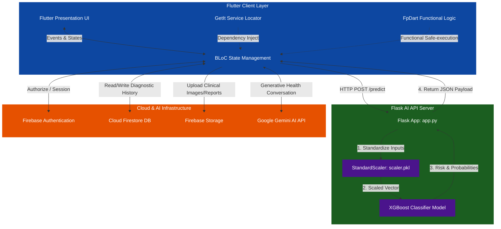

# CardioGaurd

<div align="center">
  <h3>🛡️ AI-Powered Cardiac Health Defense & Risk Assessment Platform 🛡️</h3>
  <p><i>A cutting-edge, clinical-grade Full-Stack Machine Learning application combining Cross-Platform Mobile Design, Generative AI, and Scalable Backend Architecture to revolutionize heart disease screening.</i></p>

  <p>
    
    
    
    
    
  </p>
  <p>
    <!--  -->
    
    
  </p>
</div>

---

## 📖 Table of Contents
1. [Overview](#-overview)
2. [Key Features](#-key-features)
3. [System Architecture](#-system-architecture)
4. [Machine Learning Component](#-machine-learning-component)
5. [Backend API Server (Flask)](#-backend-api-server-flask)
6. [Frontend Mobile Application (Flutter)](#-frontend-mobile-application-flutter)
7. [Installation & Setup](#-installation--setup)


---

## 🌟 Overview

**CardioGuard** is a state-of-the-art, end-to-end medical technology solution developed to assist in the early identification and monitoring of heart disease risks. By bridging the gap between sophisticated **Machine Learning algorithms** and intuitive **User Interfaces**, CardioGuard empowers patients and clinical practitioners with instant, high-accuracy diagnostic indicators, medical history tracking, and a smart generative conversational assistant.

The platform is designed around a decoupled, service-oriented **Client-Server Architecture**:
* **Mobile Client:** Formulated using **Flutter (Clean Architecture)** for multi-platform delivery, rich state management (BLoC), and dynamic, responsive presentation.
* **Predictive Server:** An optimized **Flask API** running a high-precision **XGBoost Classifier**, tuned via **Optuna** and serialized safely behind server endpoints.
* **Cloud & AI Infrastructure:** Backed by **Firebase** for secure synchronization and user identity, and **Google Gemini** for generative cardiovascular wellness guidance.

---

## ✨ Key Features

| Feature | Description | Technical Stack |
| :--- | :--- | :--- |
| **🧠 AI Risk Assessment** | Formulates clinical predictions utilizing 13 standard patient biomarkers. Returns diagnostic confidence, disease probability, and scaled metrics. | `Python`, `XGBoost`, `Scikit-learn`, `Flask` |
| **📊 Dynamic Health Dashboard** | Illustrates interactive tracking of patient vital parameters, predictive historical stats, and risk graphs. | `Flutter`, `fl_chart` |
| **💬 Gemini AI Chat Assistant** | Provides real-time virtual coaching and conversational feedback on cardiac health, nutrition, and exercise lifestyle modifications. | `Google Gemini API`, `Dart` |
| **🔒 Secure Authentication** | Implements standard medical user profiles, supporting persistent sign-ins and secure session authorizations. | `Firebase Auth` |
| **☁️ Cloud Sync & History** | Stores and structures historical patient logs to track cardiac fluctuations over time, fully accessible from multiple devices. | `Cloud Firestore`, `Firebase Storage` |

---

## 🗺️ System Architecture

CardioGuard utilizes a distributed micro-architecture. The separation of concerns ensures that heavy, data-sensitive calculations occur safely on a dedicated Python backend, preserving the client's local performance and model source confidentiality.



---

## 🧠 Machine Learning Component

The predictive brain of CardioGuard is housed in the `Machine Learning` directory. It uses a high-performance tree-boosting classifier designed to process tabular medical diagnostics with supreme accuracy.

### 1. Dataset Specifications
* **Source:** `cleaned_merged_heart_dataset.csv`
* **Dataset Size:** 1,888 unique patient records
* **Class Distribution (Perfect balance):**
  * **Disease Cases (Target = 1):** 977 samples (51.75%)
  * **No Disease Cases (Target = 0):** 911 samples (48.25%)
  

### 2. Clinical Biomarkers (13 Features)
CardioGuard bases its risk evaluations on 13 critical medical metrics:

| # | Feature Name | Description | Acceptable Clinical Range / Type |
| :--- | :--- | :--- | :--- |
| **1** | `age` | Patient's age | $29 \rightarrow 77$ years |
| **2** | `sex` | Biological sex | $1$ = Male \| $0$ = Female |
| **3** | `cp` | Chest pain type classification | $0$ = Typical Angina \| $1$ = Atypical Angina \| $2$ = Non-anginal Pain \| $3$ = Asymptomatic |
| **4** | `trestbps` | Resting systolic blood pressure | $94 \rightarrow 200$ mm Hg (on admission) |
| **5** | `chol` | Serum cholesterol | $126 \rightarrow 564$ mg/dl |
| **6** | `fbs` | Fasting blood sugar concentration | $1$ = True (> 120 mg/dl) \| $0$ = False ($\le$ 120 mg/dl) |
| **7** | `restecg` | Resting electrocardiographic results | $0$ = Normal \| $1$ = ST-T wave abnormality \| $2$ = Left ventricular hypertrophy |
| **8** | `thalachh` | Maximum heart rate achieved during stress test | $71 \rightarrow 202$ bpm |
| **9** | `exang` | Exercise-induced angina | $1$ = Yes \| $0$ = No |
| **10**| `oldpeak` | ST segment depression induced by exercise | $0.0 \rightarrow 6.2$ (relative to rest) |
| **11**| `slope` | Peak exercise ST segment slope | $0$ = Upsloping \| $1$ = Flat \| $2$ = Downsloping |
| **12**| `ca` | Number of major vessels colored by fluoroscopy | $0 \rightarrow 4$ |
| **13**| `thal` | Thalassemia blood condition severity | $1$ = Normal \| $2$ = Fixed Defect \| $3$ = Reversible Defect |

### 3. Data Processing & Pipeline
* **Stratified Splitting:** To avoid statistical deviation between slices, a stratified partition split was applied:
  * **Train Set (60%):** 1,132 patient records (for weight updating).
  * **Validation Set (20%):** 378 patient records (for hyperparameter tuning).
  * **Test Set (20%):** 378 patient records (held out purely for final metric assessment).
* **Data Leakage Mitigation:** A common machine learning error is fitting transformers on the entire dataset. In CardioGuard, `StandardScaler` is fitted **strictly on the Train Set**, and subsequently applied to transform the Validation and Test vectors.
* **Scaling Rationale:** Vital ranges vary heavily (e.g., Cholesterol $\approx 250$ vs. Oldpeak $\approx 1.5$). Standardization enforces a zero-mean, unit-variance normal distribution, stopping high-range parameters from drowning out low-range, highly critical clinical indicators.

### 4. Training, Optimization & Results
* **Algorithm:** **XGBoost (Extreme Gradient Boosting Classifier)**. Selected due to its unmatched efficiency, handling of non-linear interactions, and proven superiority in processing clinical tabular data compared to Deep Neural Networks.
* **Hyperparameter Tuning:** Tuned with **Optuna**, utilizing a Bayesian Optimization framework (TPE Sampler) over 100 trials to select optimal learning rates, tree depth, and regularization factors.

#### 📈 Final Model Evaluation Performance:
```yaml
Train Accuracy:      100.00%
Validation Accuracy:  96.56%
Test Accuracy:        97.35%
Test AUC-ROC:        0.9978
Train-Val Gap:         3.44%
Train-Test Gap:        2.65%
```

#### 📋 Detailed Classification Report (Test Set):
* **Heart Disease Class (Positive):**
  * **Precision:** `96.97%`
  * **Recall:** `97.96%`
  * **F1-Score:** `97.46%`
* **Healthy Control Class (Negative):**
  * **Precision:** `97.78%`
  * **Recall:** `96.70%`
  * **F1-Score:** `97.24%`

---

## 🖥️ Backend API Server (Flask)

The Flask server is written in **Python** (located in `Backend/heart_disease_risk_assessment_backend/app.py`). It loads the trained assets (`xgboost_heart_disease_model.pkl`, `scaler.pkl`) and stands as a high-performance web endpoint.

### Endpoints Map
1. **`GET /`** (Health Check)
   * *Returns:* Status indicators confirming whether Flask is running and the ML files are successfully initialized in memory.
2. **`GET /features`**
   * *Returns:* The ordered list of required JSON parameters to inform frontend validations.
3. **`POST /predict`**
   * *Accepts:* JSON body representing a single patient, or a collection list for batch assessments.
   * *Returns:* Binary prediction status, disease probabilities, and model confidence scores.

#### Sample API Request Payload:
```json
{
  "age": 55,
  "sex": 1,
  "cp": 2,
  "trestbps": 130,
  "chol": 250,
  "fbs": 0,
  "restecg": 1,
  "thalachh": 150,
  "exang": 0,
  "oldpeak": 1.2,
  "slope": 1,
  "ca": 0,
  "thal": 2
}
```

#### Sample API Response Payload:
```json
{
  "success": true,
  "count": 1,
  "predictions": [
    {
      "prediction": "Disease",
      "prediction_code": 1,
      "probability_disease": 0.87,
      "probability_no_disease": 0.13,
      "confidence": 0.87
    }
  ]
}
```

---

## 📱 Frontend Mobile Application (Flutter)

Located inside `Frontend/cardiogaurd/`, the client application is designed using a robust multi-layered architectural approach.

### 📐 Feature-First Clean Architecture
The code utilizes a modular directory system that strictly segregates business logic from the user interface:

```
lib/
├── app/                  # Application-wide routing & global setup
│   ├── di/               # Dependency Injection (GetIt service registrations)
│   └── router/           # GoRouter declarations & deep links
├── core/                 # Shared resources across multiple features
│   ├── constants/        # Global colors, styling tokens, asset paths
│   ├── enums/            # State enums & risk types
│   ├── error/            # Structured Failure classes
│   ├── services/         # Device hardware access (e.g., ImagePicker, Network)
│   ├── theme/            # Material Design 3 light/dark palette schemes
│   └── widgets/          # Reusable customized visual widgets
└── features/             # Fully self-contained app feature slices
    ├── auth/             # Patient / Doctor Account registration and login
    ├── dashboard/        # Graphic vital charts and statistics representation
    ├── assessment/       # Form collecting 13 biomarks and querying Flask
    ├── chat/             # Chat dialog with Google Gemini virtual specialist
    ├── history/          # Historical storage list with cloud replication
    ├── doctor/           # Clinical physician dashboard and messaging
    └── patient/          # Patient user profile management
```

### 📦 Key Ecosystem Packages
* **`flutter_bloc` & `equatable` (v9.1.1):** Separates presentation layouts from core computational logic using unidirectional streams, reducing memory leakage and optimizing UI re-renders.
* **`get_it` (v8.2.0):** Lightweight dependency injector facilitating decoupled global service locators for singletons.
* **`fpdart` (v1.1.1):** Implements strong functional programming constructs (e.g., `Either<Failure, Success>`) to ensure absolute predictability and prevent unhandled runtime errors.
* **`go_router` (v17.2.0):** Offers declarative, URL-based cross-platform routing that easily integrates nested navigation stacks.
* **`fl_chart` (v1.2.0):** Displays responsive vital graphs, highlighting patient trend variances.
* **`google_generative_ai` (v0.4.0):** Establishes prompt-guided conversational context with Google Gemini for cardiac educational support.

---

## ⚙️ Installation & Setup

Follow these detailed steps to set up the entire CardioGuard project locally on your development machine.

### Prerequisites
* **Flutter SDK:** `^3.16.x` or later (with Dart `^3.x`)
* **Python:** `3.8` up to `3.11` (recommended)
* **Node.js / Firebase CLI:** Installed globally if planning custom Firebase changes
* **Git:** For repository cloning

---

### Step 1: Backend Server Deployment

1. Navigate to the backend directory:
   ```bash
   cd Backend/heart_disease_risk_assessment_backend
   ```

2. Create a clean Python virtual environment:
   ```bash
   # On Windows
   python -m venv venv
   .\venv\Scripts\activate

   # On macOS/Linux
   python3 -m venv venv
   source venv/bin/activate
   ```

3. Upgrade standard environment packaging tools:
   ```bash
   pip install --upgrade pip setuptools
   ```

4. Install the backend requirements:
   ```bash
   pip install flask flask-cors pandas numpy scikit-learn xgboost
   ```

5. Verify that your core serialization files (`xgboost_heart_disease_model.pkl`, `scaler.pkl`, `feature_names.pkl`) are in the backend directory.

6. Launch the Flask API server:
   ```bash
   python app.py
   ```
   *The server will boot up locally at `http://127.0.0.1:5000`.*

---

### Step 2: Frontend App Deployment

1. Navigate to the mobile client directory:
   ```bash
   cd ../../Frontend/cardiogaurd
   ```

2. Clean and fetch all required pub packages:
   ```bash
   flutter clean
   flutter pub get
   ```

3. **Configure Google Gemini AI:**
   To enable the generative chat assistant, you must provide your Gemini API key. Ensure this key is set in your environment variables or loaded through your secure local configuration:
   ```bash
   # Example of launching with custom dart-define parameters
   flutter run --dart-define=GEMINI_API_KEY="YOUR_ACTUAL_API_KEY_HERE"
   ```

4. **Firebase Configuration:**
   * Make sure that your `google-services.json` (for Android) or `GoogleService-Info.plist` (for iOS) is fetched from your Firebase Console.
   * Place `google-services.json` in `android/app/` and `GoogleService-Info.plist` in `ios/Runner/`.
   * Configure Cloud Firestore, enabling both Authentication (Email/Password) and standard storage buckets.

5. **Configure the Backend API Endpoint:**
   Before compiling, adjust the API endpoint depending on your development environment. Open the remote datasource implementation file at [risk_ml_remote_datasource_impl.dart](file:///c:/Users/user/Desktop/CardioGuard/Frontend/cardiogaurd/lib/features/assessment/data/datasources/risk_ml_remote_datasource_impl.dart) and check the `endpoint` variable:
   ```dart
   final String endpoint = 'http://192.168.1.7:5000/predict'; // For Physical Devices
   // final String endpoint = 'http://10.0.2.2:5000/predict';   // For Android Emulators
   ```

   > [!IMPORTANT]
   > * **Android Emulator:** Uncomment and use `http://10.0.2.2:5000/predict`. The IP `10.0.2.2` is a special loopback interface on Android Emulators mapping directly to your development PC's `localhost` (`127.0.0.1`).
   > * **Physical Device:** Use your PC's actual local network IP address (e.g., `http://192.168.1.7:5000/predict`). You can retrieve this address:
   >   * Directly from the console output printed when you boot your Flask Backend server.
   >   * Or by executing `ipconfig` (on Windows CMD) or `ifconfig` / `ip a` (on macOS/Linux Terminals).
   >   * *Note: Ensure both your development PC and your physical phone are connected to the exact same local Wi-Fi subnet.*

6. Compile and run the Flutter app:
   ```bash
   # Run on any connected emulator or desktop target
   flutter run
   ```

---

### Step 3: Machine Learning Model Notebook (Optional)

If you wish to re-train the model or explore the data pipelines:
1. Navigate to the ML directory:
   ```bash
   cd "../../Machine Learning"
   ```
2. Activate your Python environment.
3. Install Jupyter: `pip install jupyter optuna matplotlib seaborn`
4. Boot up the notebook server:
   ```bash
   jupyter notebook
   ```
5. Open and execute the cells inside `heart_disease_prediction_fixed.ipynb`.
